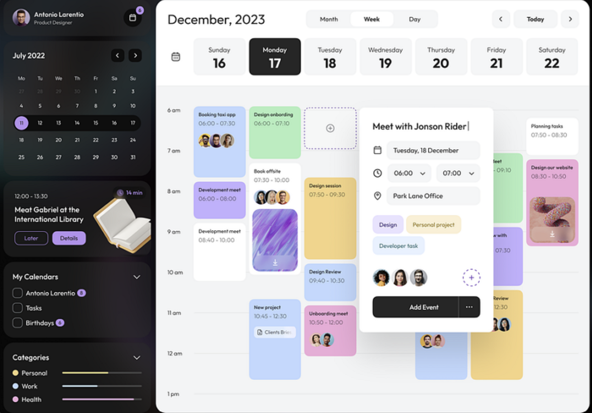

# Winnow — UI Design References

Visual references to consult when building the UI (the responsive shell in
Phase 0.3, the Calendar module in Phase 4, and the Phase 5 visual-design pass).
These are **directional references**, not pixel specs to clone — see
"Reconciling with Winnow's aesthetic rules" at the bottom.

---

## Reference 1 — Calendar dashboard (primary layout reference)

> **Image file:** [`UI-Example.png`](./UI-Example.png), stored alongside this doc.

A polished two-pane calendar/scheduling app. Why it's a strong reference: its
**dark sidebar + light main** split is essentially the responsive shell we're
building in 0.3, and its calendar treatment maps directly onto the Phase 4
module.

### Layout
- **Two panes:** a fixed **dark (near-black) left sidebar** + a **light main
  content area**. Generous rounded corners (~12–16px), soft shadows, lots of
  whitespace, friendly medium contrast.
- This is a **desktop** composition. For Winnow's "equal-priority responsive"
  rule, the sidebar collapses to the **mobile bottom tab bar**; the main area
  is what the phone shows.

### Sidebar (top → bottom)
- **Profile block:** avatar + name + role, plus a notification bell with a
  count badge.
- **Mini month calendar:** weekday headers, prev/next chevrons, **today marked
  as a filled circular pill** (brand purple in the ref), muted out-of-month days.
- **"Up next" highlight card:** time range, event title, `Later` / `Details`
  buttons, a small illustration, and a duration chip ("14 min").
- **"My Calendars"** list: checkboxes + item counts (e.g. Antonio 8, Tasks,
  Birthdays 6).
- **"Categories"** with **colored horizontal progress bars** — Personal
  (yellow), Work (blue), Health (pink).

### Main area
- **Big month/year title** (e.g. "December, 2023").
- **Month / Week / Day** segmented toggle; **‹ Today ›** navigation on the right.
- **Week strip:** Sun–Sat columns with date numbers; the **selected day is a
  filled dark card**, others are light cards.
- **Time grid:** hour rows (6am–1pm visible), events as **rounded pastel cards**
  showing title + time range. Some cards carry **stacked attendee avatars**;
  some carry a **thumbnail image** with a download affordance.

### Add-event popover
- White rounded card anchored to a grid slot. Contents: **title input**; icon
  rows for **date**, **time** (two start/end dropdowns), **location**;
  **category tag pills** (Design, Personal project, Developer task); an
  **attendee avatar stack** with an add (`+`) button; a primary **black "Add
  Event"** button + overflow (`…`).
- Good pattern to reuse for Winnow's event create/edit (Phase 4) and, in spirit,
  the quick-add flows across modules.

### Color system (event/category encoding)
- Soft pastels encode category/type: **lavender-purple, mint green, sky blue,
  butter yellow, pink**, plus plain **white** cards. Category color is the main
  encoding device (echoed in the sidebar Categories bars).

### Style language to carry over
- Rounded, card-based surfaces; soft elevation; airy spacing.
- Clear type hierarchy: large bold headers, small muted labels.
- Dark sidebar as an anchoring "chrome" against a light working canvas.

---

## How this maps to Winnow

- **0.3 shell:** adopt the dark-sidebar / light-main split for desktop; sidebar
  hosts nav + (later) the mini-calendar and category filters. Mobile = bottom
  tabs.
- **Dashboard:** the sidebar "Up next" card and the Categories progress bars are
  good models for dashboard cards (today's events, budget/macros as progress).
- **Phase 4 Calendar:** week/day grid, pastel event cards, and the add-event
  popover are near-direct references.
- **Budget/Macros:** the horizontal progress-bar treatment suits
  spent-vs-budgeted and macros-vs-target.

## Reconciling with Winnow's aesthetic rules

The reference is multi-pastel on light/dark. Winnow's aesthetic direction calls
for **one dominant color + a single sharp accent** and specific fonts
(Bricolage Grotesque / Fraunces / JetBrains Mono). Use this reference primarily
for **layout, structure, and interaction patterns**; the exact palette gets
reconciled in the **Phase 5 design pass** — most likely by keeping a
color-coded category system as the *accent* language while committing to one
dominant brand color for the shell/chrome, rather than cloning the five-pastel
scheme wholesale.
